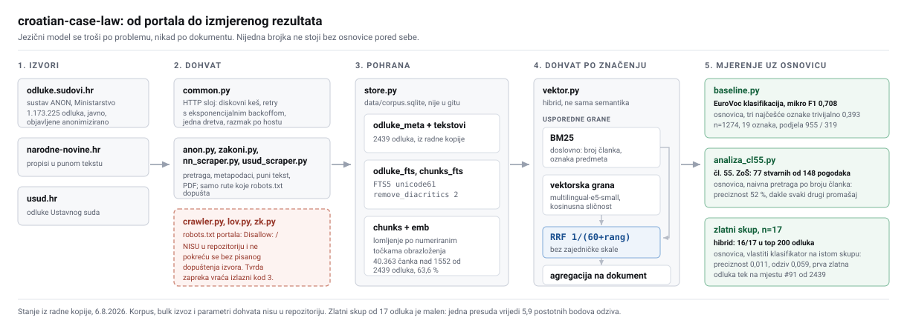

# croatian-case-law

**Lokalni korpus hrvatske sudske prakse s punotekstnim i vektorskim indeksom, uz
osnovicu pored svake brojke.** Portal `odluke.sudovi.hr` ima 1.173.225 odluka i
poslužuje jedan upit po jedan; ovaj alat gradi lokalnu bazu nad kojom se ista
analiza vrti koliko god puta bez ijednog mrežnog zahtjeva.

## Rezultat

Sve izmjereno nad korpusom u radnoj kopiji (2439 odluka, 6.8.2026). Osnovica
stoji uz svaku mjeru; brojka bez osnovice ne ulazi u ovu tablicu.

| Mjera | Rezultat | Osnovica pored njega |
|---|---|---|
| EuroVoc klasifikacija, mikro F1 | **0,708** | **0,393** trivijalno, tri najčešće oznake. n=1274, 19 oznaka, podjela 955 / 319 |
| Razlučivanje istoimenih čl. 55. | **77 stvarnih** od 148 pogodaka | naivna pretraga po broju članka: preciznost **52 %**, dakle svaki drugi pogodak je drugi propis |
| Ima li objavljene prakse za zamjenu šuma (čl. 55. ZoŠ) | **0 presuda** | kontrolne fraze nad istom tražilicom: **1845 / 1680 / 1233** pogotka, dakle nula nije kvar pretrage |
| Dohvat na zlatnom skupu, n=17 | hibrid: **16/17** u top 200 odluka | vlastiti klasifikator na istom skupu: preciznost **0,011**, odziv **0,059**, prva zlatna odluka tek na **#91 od 2439** |

**Zadnji redak je negativan i o vlastitom radu, i zato stoji ovdje, a ne u
fusnoti.** Bodovni klasifikator napisan baš za to pitanje poredao je prvu
korisnu presudu na 91. mjesto, dok postojeći hibrid nađe 16 od 17 u prvih 200.
Dijagnoza je da dohvat nije bio pokvaren, nego formulacija upita.

Ograde koje idu uz gornje brojke:

- Korpus je prikupljen ciljano oko šumarske tematike (Zakon o šumama citiran je
  u 1297 od 2439 odluka), pa se brojke **ne prenose** na bazu od 1,17 milijuna.
- Zlatni skup od 17 odluka je malen: jedna presuda vrijedi 5,9 postotnih bodova
  odziva. Svako podešavanje pragova protiv tih 17 je preprilagodba.
- Brojka 16/17 izmjerena je **na razini dokumenta**. Vektorski indeks pokriva
  40.363 čanka nad 1552 od 2439 odluka (63,6 %), pa se ne prenosi na odluke koje
  još nisu indeksirane.
- Analiza čl. 55. izvedena je nad 2437 odluka koliko ih je korpus imao u tom
  trenutku; radna kopija danas ima 2439.
- Brojke koje su opis opsega (broj odluka, broj oznaka, broj propisa) nisu mjere
  uspješnosti nego nazivnik, i kao takve nemaju osnovicu.

Postupak i pune tablice: [`docs/mjerenje.md`](docs/mjerenje.md),
[`docs/baseline.md`](docs/baseline.md), [`SUME55/analiza/`](SUME55/analiza/).

## Arhitektura



## Što je ovdje tehnički zanimljivo

**1. Poluga sustava je u formulaciji upita, i to je izmjereno, ne pretpostavljeno.**
Isti stroj, isti korpus, isti indeks, tri formulacije istog pravnog pitanja:
`kako doci do kuce preko sumskog zemljista` daje 3 jake presude u prvih 8
čanaka, `kako otkupiti parcelu da dodem do kuce` daje 2, a korisnikova vlastita
formulacija `otkup parcele od drzave` daje **0**. Stari postupak je umjesto sloja
koji prepisuje pitanje imao jednu ručno pogođenu frazu, a ta fraza ima **0
pogodaka u cijelom korpusu**, pa je sve nizvodno naslijedilo njezinu pogrešku.
Nalaz je jeftin za izreći i skup za otkriti: traži zamrznut zlatni skup i
mjerenje odziva, a ne dojam o kvaliteti rezultata.

**2. FTS5 s `remove_diacritics 2` nema hrvatski korjenovatelj, i to košta točno
pet presuda.** Konfiguracija rješava dijakritike, pa `sumsko zemljiste` nalazi
`šumsko zemljište`. Ne rješava morfologiju, jer SQLite za hrvatski nema
korjenovatelj:

| oblik | dokumenata | zlatnih od 17 |
|---|---|---|
| `dosjelost` | 279 | 8 |
| `dosjelo*` | 508 | **13** |
| `okućnic` | **0** | 0 |
| `okućnic*` | 143 | 4 |

Izostanak jedne zvjezdice odnosi 5 zlatnih presuda, a `okućnic` bez nje vraća
čistu nulu iako pojam u korpusu postoji 143 puta. To nije problem modela nego
prefiksnog upita, i popravlja se bez ijednog GPU sata.

**3. Broj članka nije identifikator, i klasifikator to mora znati.** Čl. 55.
postoji u Zakonu o šumama, u Zakonu o naknadi za oduzetu imovinu i u ranijim
zakonima o šumama, uz posve različit sadržaj. Naivna pretraga po broju članka
vraća 148 pogodaka od kojih se **77** doista odnosi na Zakon o šumama, dakle
preciznost 52 %. Rješenje je tražiti broj članka isključivo u prozoru od 400
znakova oko naziva propisa. Ovo je tip odluke koji se ne izvodi iz podataka nego
iz poznavanja domene, a mjeri se kao svaki drugi.

## English summary

This project turns Croatian case law into a local, searchable corpus. It scrapes
decisions from the state portal, stores them in SQLite with an FTS5 full-text
index plus embeddings, and runs legal analysis over them. Every number below has
a baseline next to it, including one that shows the author's own classifier is
bad.

| Measure | Result | Baseline next to it |
|---|---|---|
| EuroVoc classification, micro F1 | **0.708** | **0.393** trivial, three most frequent labels; n=1274, 19 labels, 955/319 split |
| Disambiguating same-numbered articles | **77 real** of 148 hits | naive article-number search: **52 %** precision |
| Published case law on forest-land exchange | **0 judgments** | control phrases on the same search engine: **1845 / 1680 / 1233** hits |
| Retrieval on a 17-item gold set | hybrid: **16/17** in top 200 documents | own classifier: precision **0.011**, recall **0.059**, first gold item at rank **#91 of 2439** |

Three technical choices are worth a look: FTS5 with `remove_diacritics 2`, so
`sumsko zemljiste` still matches `šumsko zemljište`; chunking by the numbered
points of a judgment's reasoning instead of by character count; and a hybrid of
BM25 and vector search merged through Reciprocal Rank Fusion. The corpus is
topically biased towards forestry law, so none of these figures transfer to the
full 1.17 million decisions. The rest of the documentation is in Croatian.

## Odnos prema izvoru, i što se ovdje ne pokreće

**`robots.txt` portala `odluke.sudovi.hr` glasi `Disallow: /`.** Provjereno
5.8.2026. Dopuštene su samo informativne stranice (`/Home/About`, `/Home/Privacy`
i slične); ruta koja nosi nabrajanje i dohvat teksta pod zabranom je.

Posljedice, izričito:

1. **Moduli za sustavno nabrajanje portala (`crawler.py`, `lov.py`, `zk.py`)
   nisu u ovom repozitoriju** i ne objavljuju se. Ne objavljuju se ni njihovi
   radni parametri: ritam dohvata, broj veza, particioniranje i URL obrasci
   listinga.
2. **Ti se moduli ne pokreću bez pisanog dopuštenja Ministarstva pravosuđa,
   uprave i digitalne transformacije.** Tvrda zapreka u kodu to provodi i vraća
   izlazni kod 3 prije prvog zahtjeva. Zaobilaznica postoji, ali upisuje oznaku
   pravne osnove u bazu; takvo dopuštenje ne postoji, pa nije korištena.
3. **Puni crawl nije izveden i ne preporučuje se.** Ne zato što je skup, nego
   zato što ga `robots.txt` zabranjuje. Preporučeni put je zahtjev Ministarstvu
   za službeni izvoz, a do odgovora rad nad postojećim uzorkom.

Ono što se pokreće (`anon.py`, `zakoni.py`, `nn_scraper.py`, `usud_scraper.py`)
dira samo rute koje `robots.txt` dopušta, ide jednom dretvom s razmakom po hostu
iz `common.py`, keširanjem da se isti URL ne traži dvaput i retryjem s
eksponencijalnim backoffom umjesto ponavljanja u petlji.

## Podaci i anonimizacija

Odluke dolaze iz sustava **ANON**, gdje ih Ministarstvo objavljuje **u
anonimiziranom obliku**: osobni podaci zamijenjeni su oznakama poput `[adresa]`,
`[osobni identifikacijski broj]`, `[katastarska čestica]`, a imena stranaka
svedena na inicijale. Alat anonimizaciju ne uklanja, ne zaobilazi i ne dodaje;
preuzima tekst točno kako je objavljen.

U repozitoriju je **`data/uzorak.sqlite`**: uzorak od 25 odluka, oko 550 kB,
izgrađen skriptom `scrapers/uzorak.py` iz istog portala. Postoji da pretraga radi
odmah, bez preuzimanja ijedne odluke. To je **uzorak, ne arhiva.** Puni korpus
(`data/corpus.sqlite`), bulk izvoz odluka i propisa u `SUME55/` nisu u
repozitoriju; vidi `.gitignore`. Primjeri izlaza su u `SUME55/primjeri/`.

## Zašto postoji

Portal sudske prakse na `sudskapraksa.csp.vsrh.hr` je ugašen; host danas odbija
TCP vezu. Zamijenila ga je tražilica sustava **ANON** na
[odluke.sudovi.hr](https://odluke.sudovi.hr), koja sadrži preko 1,17 milijuna
odluka i dopunjuje se dnevno. Namijenjena je pretrazi u pregledniku, jedan upit
po jedan. Za sustavnu analizu treba lokalni korpus: preuzeti jednom,
pretraživati koliko god puta.

| Modul | Uloga |
|---|---|
| `common.py` | HTTP sloj: diskovni keš, retry s backoffom, razmak po hostu |
| `anon.py` | Klijent za odluke.sudovi.hr (pretraga, metapodaci, puni tekst, PDF) |
| `store.py` | Korpus: SQLite + FTS5, inkrementalno, bez ponovnog preuzimanja |
| `vektor.py` | Semantička pretraga i hibrid BM25 uz kosinusnu sličnost, RRF fuzija |
| `baseline.py` | Osnovica za klasifikaciju po EuroVocu (TF-IDF, OneVsRest) |
| `zakoni.py` | Propisi u punom tekstu s Narodnih novina |
| `analiza_cl55.py` | Domenski klasifikator za čl. 55. Zakona o šumama |
| `u_pdf.py` | Pretvorba izvezenih odluka u PDF |

## Primjer analize: čl. 55. Zakona o šumama

Pitanje: postoji li objavljena praksa o zamjeni šuma i šumskih zemljišta u
vlasništvu RH? Postupak i rezultat u [`SUME55/analiza/`](SUME55/analiza/).

- Pretraga točnim frazama nad tražilicom (1.173.225 odluka): **0 pogodaka** za
  `"zamjena šuma i šumskih zemljišta"`, `"okrupnjivanja šuma"`,
  `"susjedne gospodarske jedinice"`.
- Da nula nije posljedica pokvarene pretrage, provjereno kontrolnim frazama nad
  istom tražilicom: `"Zakona o šumama"` 1845, `"šumskih zemljišta"` 1680,
  `"šuma i šumskih zemljišta"` 1233.
- Preuzeto **2437 odluka** koje citiraju Zakon o šumama i provjereno strojno nad
  punim tekstovima: čl. 55. u dosluhu sa Zakonom o šumama pojavljuje se u **77**
  odluka, a **nijedna** ga ne veže uz zamjenu. Svih 77 odnosi se na raniji
  članak o zabrani dosjelosti.

Zaključak: institut zamjene iz čl. 55. nema objavljene sudske prakse. Razlog je
strukturni, ne slučajan: prema st. 2. to je odluka ministarstva i potom ugovor
koji sklapa ministar, pa uspješna zamjena završava uknjižbom i nikad ne proizvede
presudu.

Analiza je usput našla i da odredbu koja dopušta zamjenu šume za
**poljoprivredno** zemljište sadrži čl. 60. st. 3., a ne čl. 55., i to
istovjetnog teksta u zakonu iz 2005. i u važećem.

## Pokretanje

```bash
cd scrapers
python3 -m venv venv
./venv/bin/pip install requests beautifulsoup4 lxml
# za semantičku pretragu (povlači PyTorch):
./venv/bin/pip install "torch==2.2.2" "sentence-transformers>=2.7,<3" "numpy<2"
```

```bash
./venv/bin/python store.py                    # stanje korpusa
./venv/bin/python vektor.py index             # inkrementalno
./venv/bin/python vektor.py query "nesrazmjer vrijednosti kod zamjene" -k 8
./venv/bin/python vektor.py query "..." --nacin bm25    # samo doslovno
./venv/bin/python baseline.py                 # osnovica po EuroVocu
./venv/bin/python analiza_cl55.py --izvezi
```

Naredbe koje dohvaćaju s portala (`anon.py search`, `anon.py harvest`) rade nad
dopuštenim rutama; vidi odjeljak o `robots.txt` iznad. Testovi:

```bash
./venv/bin/python -m unittest discover -s ../tests
```

298 testova, prolaze u CI-ju na svakoj promjeni glavne grane. Ne diraju mrežu:
svaki radi nad vlastitom bazom, u memoriji ili u privremenoj datoteci.

## Dokumentacija

- [`docs/mjerenje.md`](docs/mjerenje.md): sve mjere s postupkom i ogradama
- [`docs/baseline.md`](docs/baseline.md): osnovica po EuroVocu, razložena po oznaci
- [`docs/metodologija.md`](docs/metodologija.md): segmentacija po strukturi
  presude, vektorizacija i hibridni RRF, izlučivanje metapodataka, i postupak
  dokazivanja da nečega u korpusu nema
- [`scrapers/README.md`](scrapers/README.md): sučelje portala i granice tražilice

## Okolina

Razvijeno i testirano na macOS 13 (Intel). PyTorch je zaključan na 2.2.2 jer je
to posljednja verzija s wheelovima za x86 macOS. Nema GPU-a, pa su sve mjere
brzine s CPU-a. CI namjerno ne instalira torch.

Autor: Hrvoje Matej, hrvoje.matej.l@gmail.com

## Licenca

- **Kod** (`scrapers/`, `tests/`): [Apache License 2.0](LICENSE).
- **Dokumentacija i analiza** (`docs/`, `SUME55/analiza/`, autorski tekst
  README-a): [CC BY 4.0](docs/LICENSE-DOCS), smije se dijeliti i prerađivati
  uz navođenje autora.
- **Tekstovi sudskih odluka** (u `data/uzorak.sqlite` i `SUME55/primjeri/`):
  službeni tekstovi iz područja sudstva, nisu predmet autorskog prava i ne
  licenciraju se.
